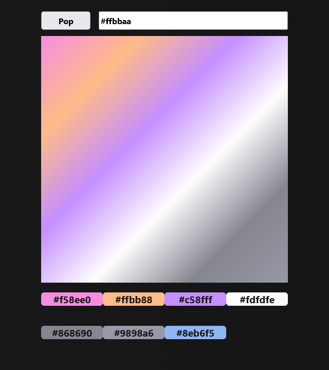

# Colors & DOM project

## Interactions with HTML and CSS through JS

## BUGs

- [] When `≤2` colors

## Near Future

### Design

- [x] Add title above all
- [] Increase readability of some colors

### Input

- [] Support Lower and Uppercase

- [] Swap to simple color when 1 hex left and use transparent when 0

- [] Add padding to allow [1-6] symbols instead will be padded with zeroes: `#f => #f00000`

- [] Make starting `#` optional

- [] Add multiple colors at once by separation them with `;`

### Questionable !?

- [] Fix grid elements gap

- [] Add refresh button

## Far Future

- [] Add support for json from web

- [] Delete colors interactively

- [] Support not only hex

- [] Change rotation of gradient

- [] Gradient animation
