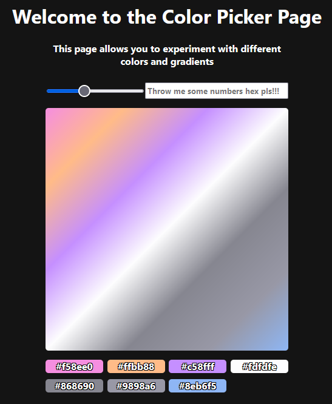

# Colors & DOM project

## Interactions with HTML and CSS through JS

## BUGs

- [X] When `≤2` colors

## Near Future

### Design

- [x] Add title above all
- [X] Increase readability of some colors

### Input

- [X] Support Lower and Uppercase

- [X] Swap to simple color when 1 hex left and use transparent when 0

- [X] Add padding to allow [1-6] symbols instead will be padded with zeroes: `#f => #f00000`

- [X] Make starting `#` optional

- [X] Add multiple colors at once by separation them with `;`

### Questionable !?

- [X] Fix grid elements gap

- [ ] Add refresh button

## Far Future

- [ ] Add support for json from web

- [X] Delete colors interactively

- [ ] Support not only hex

- [X] Change rotation of gradient

- [ ] Gradient animation
